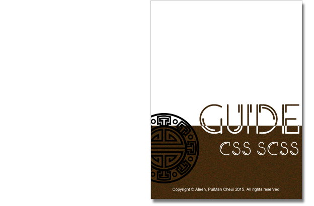

##About
- This is a book which is about the personal guide of CSS and SCSS style, to constraint my coding style. And the guides has combined with [**Airbnb**](https://github.com/airbnb/css), [**Codrops**](https://github.com/codrops) and so on.
- With the same purpose, here you can see [**JavaScript Personal Guide**](https://aleen42.gitbooks.io/javascript/content/).

 

   

## Start Reading

- Read on [**GitBook**](https://www.gitbook.com/read/book/aleen42/css)
- Downloads:
    - [**PDF**](https://www.gitbook.com/download/pdf/book/aleen42/css)
    - [**ePub**](https://www.gitbook.com/download/epub/book/aleen42/css)
    - [**mobi**](https://www.gitbook.com/download/mobi/book/aleen42/css)

## Categories

- [**Codrops CSS References**](./codrops/codrops.md)
- [**Font Content with Values**](./content/content.md)

