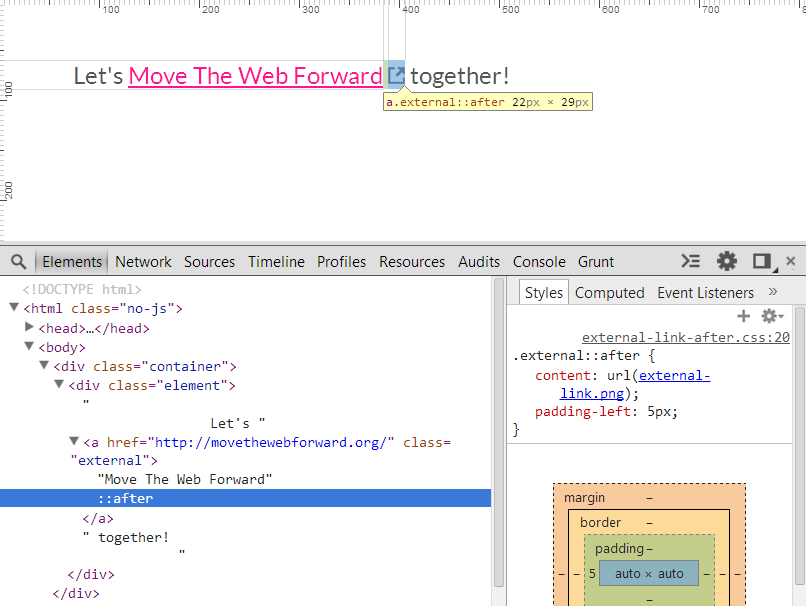

## ::after [**Back**](./../pseudoClass.md)

- `::after` is a generated content element that represents a styleable abstract last child of the respective element.
- The content inserted using `::after` is inserted after other content inside the element and is displayed inline by default. The value of the content is specified using the [`content`]() property.

#### Case 1: add a small icon to all links

```html
Let's <a href="#" class="external">Move The Web Forward</a> together!
```

```css
.external::after {
    content: url(external-link.png);
    padding-left: 5px;  /** create some space between the icon and the link */
}
```



#### Case 2: using attribute selector

```css
a[href]::after {
    color: grey;
    content: " (" attr(href) "(";   /** use attr() to get the attribute */
}
```

<p data-height="268" data-theme-id="0" data-slug-hash="WrZvVR" data-default-tab="result" data-user="aleen42" class='codepen'>See the Pen <a href='http://codepen.io/aleen42/pen/WrZvVR/'>WrZvVR</a> by aleen42 (<a href='http://codepen.io/aleen42'>@aleen42</a>) on <a href='http://codepen.io'>CodePen</a>.</p>
<script async src="//assets.codepen.io/assets/embed/ei.js"></script>

<a href="http://aleen42.github.io/" target="_blank" ></a>